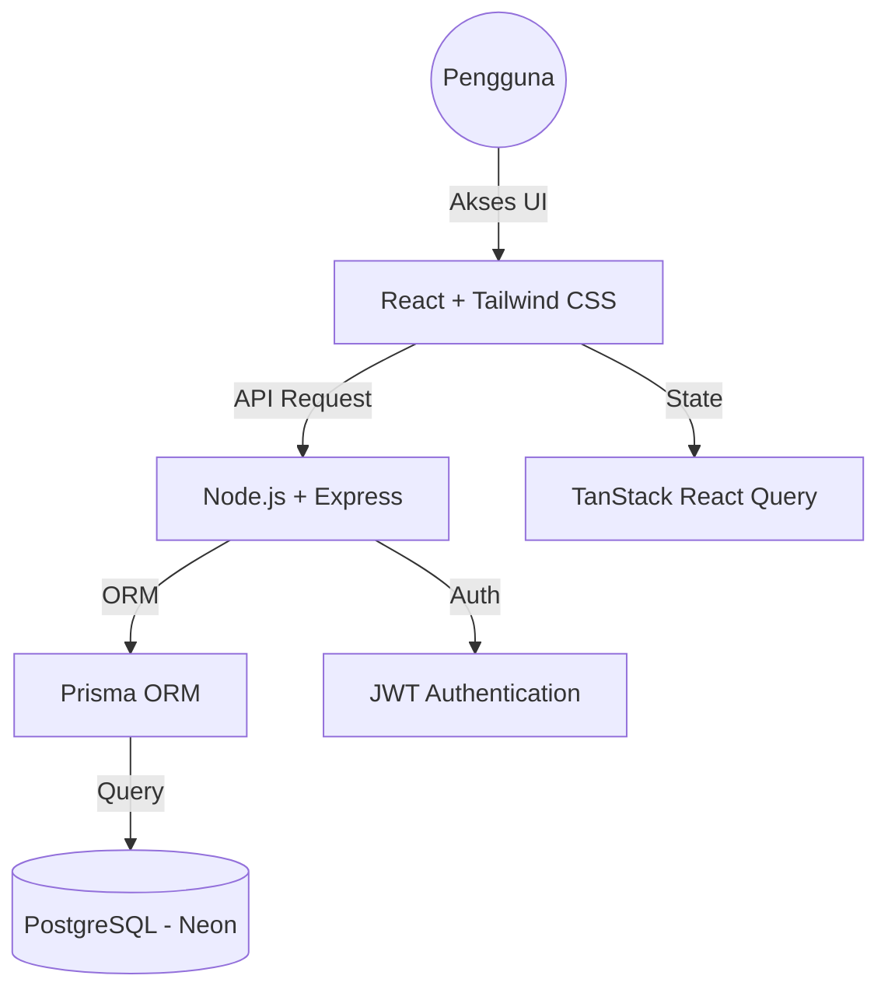

# 🖥️ Central Computer — Sistem Manajemen Toko Komputer

> **Aplikasi web manajemen operasional toko komputer** yang menangani penjualan (POS), stok, servis teknisi, pengadaan barang, dan laporan keuangan — semua dalam satu platform terintegrasi.

[](https://central-computer-demo.vercel.app)
[](LICENSE)

---

## 🏗️ Arsitektur Sistem

Sistem ini dibangun dengan arsitektur modern yang memisahkan antara *frontend* yang responsif dan *backend* yang aman.



---

## ✅ Fitur Unggulan

### 💰 Kasir & POS (Point of Sale)
- **Cepat & Efisien**: Checkout dalam hitungan detik.
- **Data Pelanggan**: Mendukung input nama pelanggan (opsional) untuk personalisasi struk.
- **Metode Pembayaran**: Tunai, Transfer, QRIS, Debit, dan Kredit.
- **Sinkronisasi Otomatis**: Stok berkurang secara real-time saat transaksi lunas.

### 🔧 Manajemen Servis & Teknisi
- **Pelacakan Status**: Pantau antrian servis dari *Scheduled* hingga *Completed*.
- **Penugasan Teknisi**: Assign teknisi spesifik untuk setiap unit servis.
- **Otomatisasi Biaya**: Gabungkan biaya sparepart dan jasa servis dalam satu nota.

### 🔐 Keamanan & Hak Akses (RBAC)
- **Role-Based Access**: Pembatasan fitur ketat berdasarkan peran pengguna:
  - **Owner**: Akses penuh ke seluruh data keuangan dan pengaturan.
  - **Admin**: Akses manajemen stok, produk, dan transaksi.
  - **Karyawan**: Terfokus pada operasional POS dan penerimaan servis (tanpa akses ke Dashboard finansial).
- **Route Protection**: Pengamanan level URL (Router) untuk mencegah akses ilegal.

### 📊 KPI & Laporan Bisnis
- **Dashboard Statis**: Ringkasan pendapatan, performa teknisi, dan barang stok menipis.
- **Manajemen Target**: Atur target pendapatan bulanan dan pantau progress secara visual.
- **Export Data**: Unduh laporan penjualan ke format CSV untuk analisis mendalam.

---

## 🛠️ Stack Teknologi

| Komponen | Teknologi |
|---|---|
| **Frontend** | React 19, Vite, Tailwind CSS v4, Recharts |
| **Backend** | Node.js, Express.js (Vercel Serverless) |
| **Database** | PostgreSQL (Neon DB Serverless) |
| **ORM** | Prisma ORM |
| **State Management** | TanStack React Query v5 |
| **Icons & UI** | Lucide React, Framer Motion |

---

## 🚀 Instalasi Lokal

**Prasyarat:** Node.js v18+ & Database PostgreSQL.

```bash
# 1. Clone repositori
git clone https://github.com/yaris/central-computer-demo.git
cd central-computer-demo

# 2. Install dependensi
npm install

# 3. Konfigurasi Environment
# Salin .env.example ke .env dan isi DATABASE_URL & JWT_SECRET
cp .env.example .env

# 4. Generate & Push Schema
npx prisma generate
npx prisma db push

# 5. Jalankan Development Server
npm run dev
```

---

## 📸 Demo Akun

| Peran | Username | Password |
|---|---|---|
| **Owner** | `owner` | `demo123` |
| **Admin** | `admin` | `demo123` |
| **Karyawan** | `kasir_demo` | `demo123` |

---

## 👨‍💻 Kontribusi & Portfolio

Proyek ini dikembangkan oleh **[Nama Anda]** sebagai bukti kompetensi dalam membangun aplikasi *Enterprise Resource Planning* (ERP) skala kecil yang *scalable*, aman, dan siap produksi.

*Segala data yang terdapat dalam demo ini bersifat fiktif dan hanya untuk tujuan demonstrasi.*
